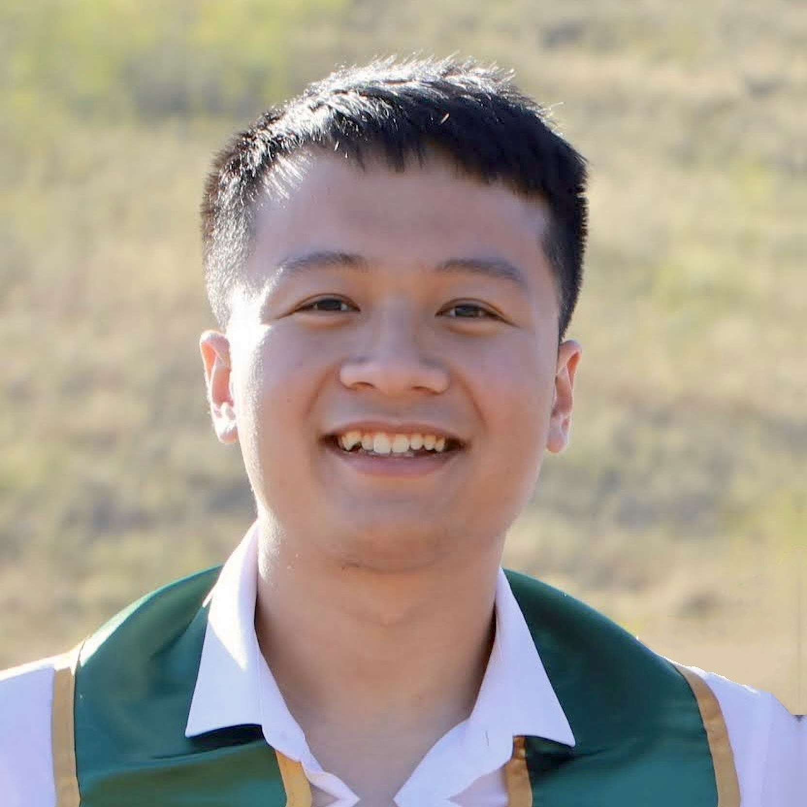

---
# Feel free to add content and custom Front Matter to this file.
# To modify the layout, see https://jekyllrb.com/docs/themes/#overriding-theme-defaults

layout: page
---

  

I earned both my B.S. and M.S. degrees in Computer Science from California Polytechnic State University, San Luis Obispo, in 2022 and 2024, under the guidance of Prof. Jonathan Ventura.

My research explores how much of the physical world can be recovered from camera sensors under challenging real-world conditions. One direction of my work combines 3D neural rendering with HDR imaging to reconstruct geometry and appearance from sparse, unconstrained, and variably exposed images and videos. Another focuses on recovering visual information under extreme exposure conditions through image denoising and HDR imaging. I have also applied deep learning to large-scale remote sensing problems.